# Sigorta Müşteri Analizi ve Dashboard Projesi

Bu proje, Kaggle platformu üzerinden elde edilen bir veri seti kullanılarak hazırlanmıştır. Amaç, şirketin müşterilerini ve davranışlarını anlamak, mevcut verileri doğru şekilde yorumlamak ve interaktif bir dashboard aracılığıyla analiz sonuçlarını görselleştirmektir.  

## 📊 Kullanılan Veriler
Veri seti aşağıdaki bilgileri içermektedir:  
- Yaş ve yaş aralıkları  
- Cinsiyet  
- Medeni durum  
- Eğitim durumu  
- Bölge  
- Meslek  
- Gelir düzeyi  
- Satın alınan sigorta ürünleri  
- Prim tutarı  
- Poliçe tipi  
- Tercih edilen iletişim kanalı, zamanı ve dili  
- Segmentasyon grubu  

Analiz, pivot tablolar ve dashboard araçları kullanılarak gerçekleştirilmiştir.  

---

## 🧹 Veri Temizleme Aşamaları
Analiz öncesi veri setinin doğru yorumlanabilmesi için aşağıdaki işlemler yapılmıştır:  
- 14 yinelenen veri tespit edilip kaldırıldı.  
- Boş satırlar temizlendi.  
- Analizde kullanılmayan sütunlar kaldırıldı veya gizlendi.  
- Veriler Türkçeleştirildi.  
- Yaş bilgisi aralıklara bölünerek ayrı sütun eklendi.  
- Prim tutarı ve gelir düzeyi para birimine çevrildi.  
- Türkçeye çevrildiğinde anlamsız kelimeler düzenlendi.  

---

## 📈 Analizler ve Sonuçlar

### **Analiz 1: Zaman Dilimine Göre Müşteri İletişim Kanalı Tercihleri**
- Pivot tablosundan elde edilen veriler kümelenmiş sütun grafiği ile görselleştirildi.  
- **Sonuç:** En çok tercih edilen kanal **e-mail**, en az tercih edilen kanal **mesaj**.  
- **Yorum:** Sabah saatlerinde telefonla iletişim tercihinin fazla olması, müşterilerin işlerini erken saatlerde yapmayı tercih ettiğini gösterebilir.  

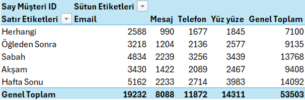  
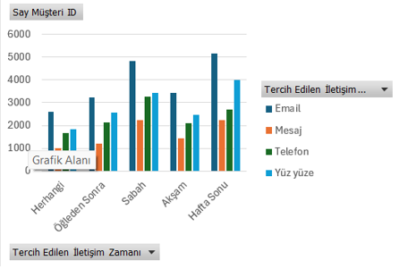  

---

### **Analiz 2: Cinsiyet ve Eğitim Durumuna Göre Müşteri Segment Grupları Dağılımı**
- Segment gruplarının cinsiyet ve eğitim durumuna göre dağılımı analiz edildi.  
- **Sonuç:** En çok müşteriye sahip grup **Segment 5**, en az müşteriye sahip grup **Segment 1**.  
- **Yorum:** Segment 5 pazarlama stratejileri için öncelikli olabilir. Segment 1 büyüme fırsatı sunabilir.  

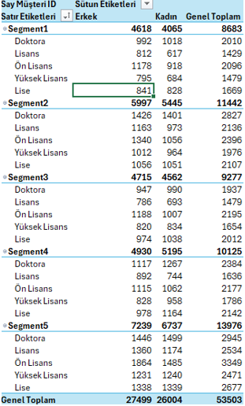  
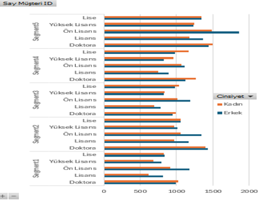  

---

### **Analiz 3: Yaş Gruplarına Göre Satın Alınan Sigorta Ürünleri**
- Satın alınan sigorta ürünleri yaş gruplarına göre analiz edildi.  
- **Sonuç:** Poliçe1 en çok 30-45 yaş arası, en az 18-29 yaş arası müşteriler tarafından satın alınmıştır.  
- **Yorum:** 30-45 yaş grubuna yönelik pazarlama faaliyetleri şirket kazancını artırabilir.  

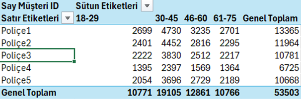  
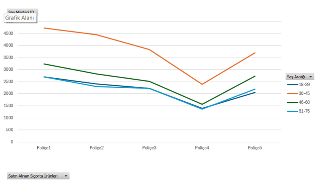  

---

### **Analiz 4: Mesleklere Göre Tercih Edilen Poliçe Türleri**
- Meslek gruplarına göre poliçe tercihleri analiz edildi.  
- **Sonuç:** En çok satın alan grup **Pazarlamacı**, en az **Hemşire**.  
- **Yorum:** Pazarlamacılar daha fazla finansal güvenceye ihtiyaç duyuyor olabilir.  

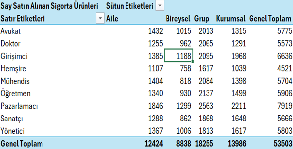  
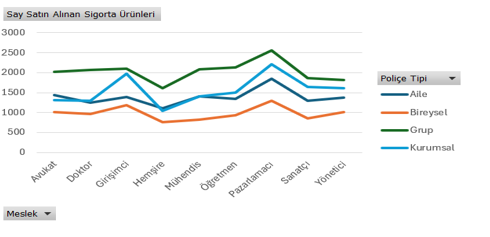  

---

### **Analiz 5: Müşterilerin Tercih Ettiği Poliçe Türleri**
- Hangi poliçe tipinin daha fazla tercih edildiği incelendi.  
- **Sonuç:** En çok tercih edilen poliçe tipi **Grup**, en az tercih edilen **Bireysel**.  
- **Yorum:** Bireysel poliçe tanıtımı artırılabilir, Grup poliçeler geliştirilerek avantaj sağlanabilir.  

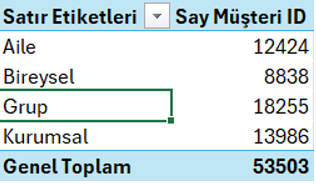  
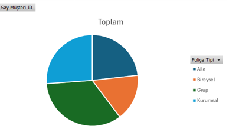  

---

## 📊 Dashboard
Proje kapsamında oluşturulan interaktif dashboard, tüm analizleri tek bir sayfada görselleştirmektedir.  
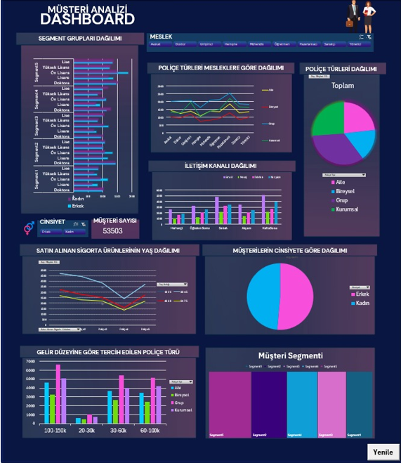  

